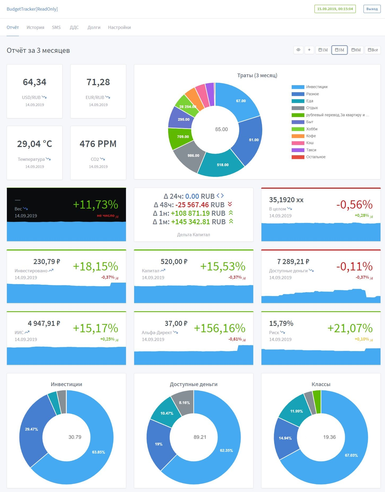
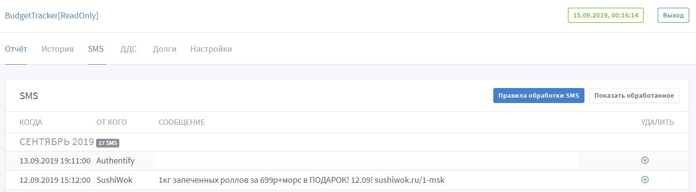

# BudgetTracker

[](https://hub.docker.com/r/diverofdark/budgettracker)
[](https://app.fossa.io/projects/git%2Bgithub.com%2FDiverOfDark%2FBudgetTracker?ref=badge_shield)
[](https://sonarcloud.io/dashboard?id=DiverOfDark_BudgetTracker)

## Описание
BudgetTracker - это персональное self-hosted решение для управления личными финансами и инвестициями. 
Основная задачу, которую решает BT - это ежедневный автоматический сбор данных и построение отчетности.

## Как запустить
Рекомендуемый способ запуска - Docker. Пример docker-compose файла:

#### docker-compose.yml
``` 
version: "3.3"
services:
  budgettracker:
    image: diverofdark/budgettracker:master
    restart: unless-stopped
    environment:
      Properties__IsProduction: 'true' # true если необходимо сохранять изменения в базу. false для локального запуска/отладки.
      ConnectionStrings__LiteDb: '/data/budgettracker.db' # Строка подключения к LiteDb, если используется локальный файл базы
    volumes:
      - /dev/shm:/dev/shm # Рекомендуется для использования скрэйпинга через Google Chrome
      - /root/bt:/data # Путь монтирования папки /data, если используется локальный файл базы
    ports:
      - "80:80"
    networks:
      public: {}

networks:
  public:
    driver: bridge
```


## Источники данных:
На данный момент поддерживаются следующие источники данных:
- **АльфаБанк**
- **АльфаДирект**
- **АльфаКапитал** _требуется SMS-интеграция_
- **Долги**: создание балансов из заведенных вручную долгов
- **Райффайзен банк**
- **FX**: Биржевые курсы валют USD/RUB, EUR/RUB, индекса S&P 500
- **LiveCoin**
- **Penenza**
- **API** (POST-endpoint)
  Пример запроса:
  ```
  # Статус на сегодня:
  POST /post-data
  name=Название+счета&value=1000.0&ccy=RUB

  # Статус на 31 февраля 2019:
  POST /post-data
  name=Название+счета&value=1000.0&ccy=RUB&when=31.02.2019

  # Добавление транзакций:
  POST /post-payment
  Content-Type: application/json

  [
    {
      "id": "123abc",
      "account": "test-account",
      "when": "01.10.2019 12:00:00",
      "amount": "5000",
      "currency": "RUB",
      "what": "Вернули долг"
    },
    {
      "id": "124abc",
      "account": "test-account",
      "when": "02.10.2019 12:00:00",
      "amount": "100",
      "currency": "RUB",
      "what": "Купил сникерс"
    }
  ]

  ```

## Табличное представление (история)

Из каждого источника данных ежедневно собираются данные в общее табличное представление.
Способ сбора данных - Selenium + ChromeWebDriver.


В случае нехватки каких-то данных(например - неуспешный парсинг) соответствующая ячейка таблицы подсвечивается черным фоном, а в подсказке видно каких данных не хватает.

Каждое значение характеризуется провайдером и названием счёта через знак ```/```. Например - _Альфа-Банк/Блиц-доход-USD_ или _FX/USD/RUB_
На основе этих данных можно строить свои вычисляемые стобцы - например посчитать сумму всего капитала из разных источников данных с конвертацией курса валют.

Примеры таких функций:
```
[Альфа-Банк/Блиц-доход-USD] * [FX/USD/RUB] + [Альфа-Банк/Блиц-доход-EUR] * [FX/EUR/RUB]
```


## Дашборд (отчёт)

На основной странице доступна система виджетов, которые берут свои значения из табличного представления.


## Долги

Возможно вручную заносить долги (тех кто должен вам - с положительным знаком, и те которые вы должны - с отрицательным знаком баланса.
Возможно также указать шаблон описания переводов для автоматического учета их в долгах 


## Интеграция с SMS:
В настоящее время возможна интеграция только с Android телефонами с использованием IFTTT и Tasker.
Для IFTTT используется простой рецепт с получением Android SMS и отправкой на **/sms**.
Для Tasker используется отправка на **/sms-tasker**. Подробнее см. код _ApiController.cs_.

Для смс есть различные правила - на текущий момент они описываются регулярными выражениями для того чтобы автоматически скрывать ненужные смс (например с кодами подтверждений) и учитывать траты из SMS, полученных от банка.




## Учет расходов

### Разбор входящих СМС

Одним из вариантов учета расходов являвется парсинг SMS, полученных с телефона.
Для этого надо в раздел с SMS добавить правило обработки вида "траты" с регулярным выражением для разбора текста сообщений, например для Raiffeisen:
```
Karta \*3436;\s+Pokupka:(?<sum>[\d.]*) (?<ccy>[A-Z]{3});\s+(?<what>.*);\s+
```
Обязательно наличие именованных групп **sum**, **ccy**, **what** с суммой траты, валютой, и описанием траты соответственно.

Для дружелюбного представления и группировки трат есть понятие категорий. Категории также используя регулярное выражение группируют траты по описанию трат. Пример использования категорий - группировка трат на такси:

```
| Категория | Щаблон           |
| --------- | ---------------- | 
| Taxi	    | .*GETT.*         |
| Taxi      | .*UBER.*	       |
| Taxi	    | .*Yandex\.Taxi.* |
```

### Импорт выписки с онлайн банка

Для поддерживаемых провайдеров (Райффайзен, Альфабанк, Модульбанк) производится автоматом импорт выписок с приходом и расходом и создаются проводки в учёте.

### Генерация выписки по изменению баланса

Для некоторых случаев (пример - изменение стоимости акций) удобно иметь "виртуальные" проводки, просто чтобы изменение баланса совпадало с движением денежных средств.
Для этого в свойствах соответствующей колонки можно включить автоматическую генерацию проводок по балансу.

### Особенности учета расходов

Бывает три категории расходов - доход, расход и перевод.
В чем их отличие? Доход и расход учитываются на графиках, в оценках динамики капитала, в виджете трат.
Перевод - специальный вид проводки, который задуман для обозначения переводов денег со счёта на счёт. 
За счёт переводов сглаживаются графики и становится валидным прогноз динамики капитала (особенно актуально для инвестиций).

## License
[](https://app.fossa.io/projects/git%2Bgithub.com%2FDiverOfDark%2FBudgetTracker?ref=badge_large)
